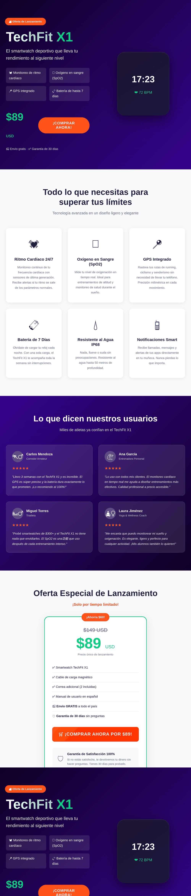
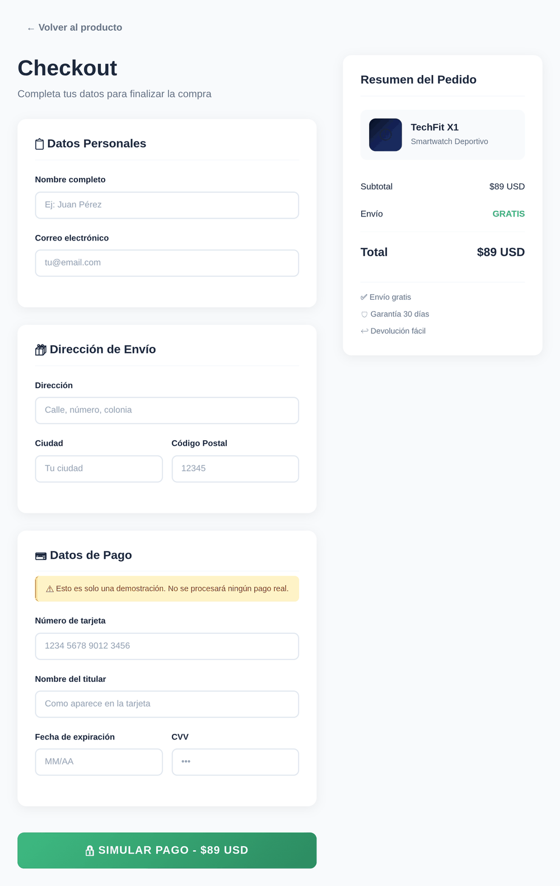

# TechFit X1 — Landing Page de Ventas

> Landing page para vender un smartwatch deportivo. Demuestra habilidades de **copywriting persuasivo** + **desarrollo Angular 19**.

## 🎯 ¿Qué hace este proyecto?

Página de aterrizaje completa para el smartwatch deportivo **TechFit X1**. Incluye:

- **Hero section** con CTA y reloj animado
- **Features** — 6 beneficios con íconos
- **Testimonios** — 4 reseñas de clientes
- **Pricing** — Precio de lanzamiento, garantía y badges de confianza
- **Checkout** — Página completa con formulario de datos personales, envío y pago simulado

## 🚀 Demo en vivo

```bash
git clone https://github.com/yafrometall/copywriting-landing-demo.git
cd copywriting-landing-demo
npm install
ng serve
```

La app estará disponible en `http://localhost:4200`.

## 🛠️ Tecnologías usadas

| Tecnología | Versión |
|------------|---------|
| Angular | 19.2 |
| TypeScript | 5.7 |
| SCSS | Custom (sin framework CSS) |
| Angular Router | Sí (standalone components) |
| Angular Forms | Template-driven (FormsModule) |

## ✨ Características principales

- **Componentes reutilizables** — hero, features, testimonials, pricing, footer
- **Diseño responsive** — móvil, tablet y escritorio con CSS Grid + media queries
- **Routing** — navegación entre landing (`/`) y checkout (`/checkout`)
- **Checkout simulado** — formulario completo con validación y alerta de éxito
- **Animaciones CSS** — reloj flotante, badge con pulso, hover effects
- **Copywriting AIDA** — Atención, Interés, Deseo, Acción

## 📸 Capturas de pantalla

| Landing Page | Checkout |
|-------------|----------|
|  |  |

## 📐 Estructura del proyecto

```
src/app/
├── components/
│   ├── hero/           # Titular, highlights, CTA, reloj animado
│   ├── features/       # 6 tarjetas de beneficios con íconos
│   ├── testimonials/   # 4 reseñas con ratings
│   ├── pricing/        # Precio, garantía, badges de confianza
│   └── footer/         # Brand, enlaces, contacto, legal
└── pages/
    ├── landing-page/   # Contenedor que ensambla todos los componentes
    └── checkout/       # Página de pago: datos, envío, tarjeta, simulación
```

## 🧠 ¿Qué aprendí haciendo este proyecto?

- Escribir **copy persuasivo** orientado a conversiones
- Organizar **componentes standalone** en Angular 19
- Implementar **routing** con navegación entre páginas
- Diseñar formularios con **validación en TypeScript**
- Crear animaciones con **CSS puro** (sin dependencias externas)

## 🔧 Cómo ejecutarlo localmente

```bash
# Clonar el repositorio
git clone https://github.com/yafrometall/copywriting-landing-demo.git
cd copywriting-landing-demo

# Instalar dependencias
npm install

# Servidor de desarrollo (hot reload)
ng serve

# Build de producción
ng build
```

El output se genera en `dist/techfit-x1`.

## 🎨 Paleta de colores

| Color | Uso |
|-------|-----|
| `#0a0a23` | Fondo oscuro primario |
| `#1e3a8a` | Azul de marca |
| `#10b981` | Verde CTA / éxito |
| `#ff6b35` | Naranja urgencia / badge |
| `#fbbf24` | Amarillo estrellas / aviso |

## 📝 License

MIT — úsalo como referencia o plantilla para tus propios proyectos.

---

## 📬 Contacto

| GitHub | LinkedIn | Email |
|--------|----------|-------|
| [github.com/yafrometall](https://github.com/yafrometall) | [linkedin.com/in/yadira-annabel-frometa-llarena-ab780671](https://linkedin.com/in/yadira-annabel-frometa-llarena-ab780671) | yafrometall@gmail.com |
